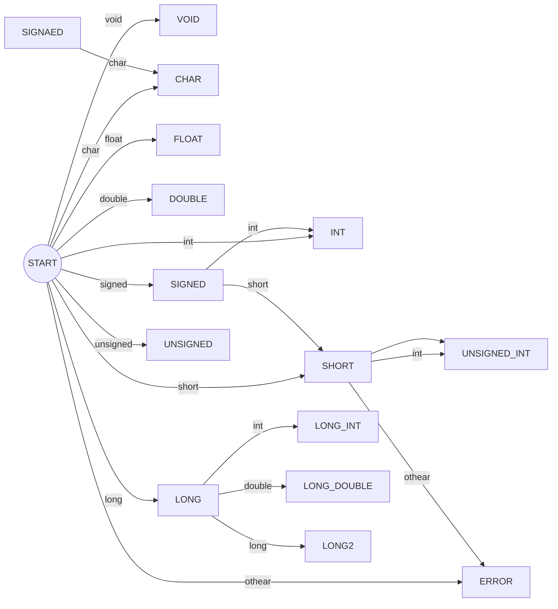

```mermaid
graph LR

    START((START)) --> | void | VOID
    START --> | char | CHAR
    START --> | int | INT
    START --> | float | FLOAT
    START --> | double | DOUBLE

    START --> | short | SHORT
    START --> | long | LONG

    START --> | signed | SIGNED
    START --> | unsigned | UNSIGNED

    START --> | othear | ERROR

    SHORT --> | int | UNSIGNED_INT
    SHORT --> |  | UNSIGNED_INT
    SHORT --> | othear | ERROR

    LONG --> | int | LONG_INT
    LONG --> | double | LONG_DOUBLE
    LONG --> | long | LONG2
    
    SIGNAED --> | char | CHAR
    SIGNED -->  | int | INT
    SIGNED --> | short | SHORT

```