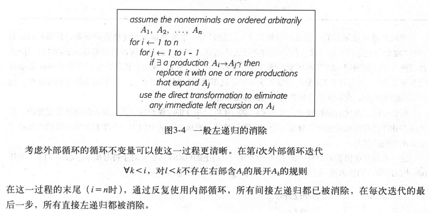

# 将非LL1文法转化为LL(1)文法，方便使用递归下降分析。

## 算法原理

### 构建CFG语法图
使用unorder_map构建CFG语法图

### 消除左递归
#### 消除直接左递归
直接左递归消除算法：
S -> Sa
S -> b
可以转化为右递归方式：
S -> bS'
S' -> aS' | e
算法实现时，对终结符A可以划分为两种产生式，左递归产生式和非左递归产生式，以此处理。

#### 消除间接左递归
实现原理：穷举所有可能的环，并打断每个环，算法如下：
排序所有的非终结符，使得顺序右边的非终结符不含左边的非终结符，从而实现无环。

消除顺序影响文法的表示形式，我希望从翻译单元开始消除，所以翻译单元首元素不能含非终结符号，因此翻译单元的顺序应该最大，即为最后一个元素。

### 提取左公因式（消除回溯）

使用前缀树消除所有的分支。

### 文法化简

CFG化简是指去除空产生式和单产生式，叫做文法化简。
文法使用两个周期规约

# update Note

2025.03.04
1. 完成初版本
